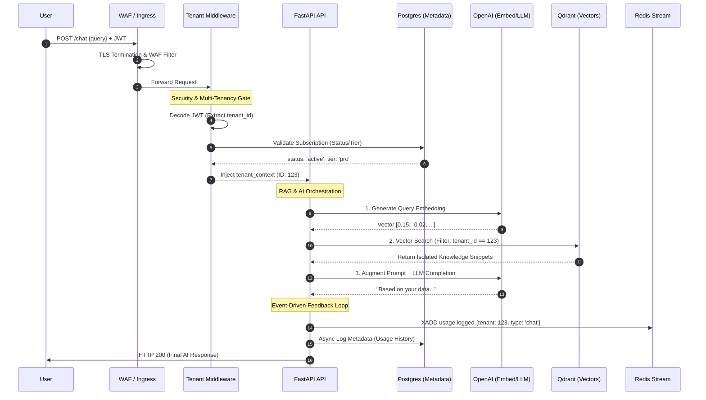

# 🏗️ Agentic AI SaaS Multi-Tenant Enterprise-grade Platform

## The 2026 Blueprint for Multi-Tenant Agentic RAG & Event-Driven Workflows for Enterprise

This repository provides a modular, enterprise-grade blueprint for a high-performance Multi-Tenant AI SaaS. It is architected to eliminate architectural debt by providing a "Secure-by-Default" foundation, moving from local development to a globally scalable Azure Kubernetes Service (AKS) deployment. The platform utilizes an event-driven core for asynchronous RAG ingestion and real-time usage-based billing.

---

## 🧩 The Five Core Pillars

### 1. AI & Event-Driven Logic
- **The Orchestrator:** A FastAPI backend acting as the primary "Producer," dispatching ingestion and logging tasks to the Event Bus.
- **Vector Engine:** Qdrant Cloud provides multi-tenant "hard-filtering," ensuring Tenant A’s data is mathematically invisible to Tenant B.
- **The Brain:** Advanced RAG pipelines utilizing OpenAI (GPT-4o/Embedding-3) for high-fidelity semantic understanding.

---

### 2. Advanced Event Bus (Redis Streams)
- **Persistence:** A persistent, append-only log that replaces transient queues.
- **Reliability:** Implements Consumer Groups and Pending Entry Lists (PEL). If a worker pod fails, the Autoclaim logic ensures the task is re-assigned and completed.
- **Decoupling:** High-latency AI tasks (embedding/indexing) are stripped from the user-facing API request path to maintain sub-second UI responsiveness.

---

### 3. SaaS Multi-Tenancy & Security
- **Database Isolation:** A robust schema on Azure Postgres Flexible Server where every row is bound to a `tenant_id` at the constraint level.
- **Security Gate:** Global JWT Middleware validates identity and subscription status at the edge, preventing "unpaid" compute usage.
- **Governance:** Utilizes Azure Managed Identities for passwordless authentication between AKS and cloud resources.

---

### 4. Usage-Based Metered Billing
- **Real-time Tracking:** Every AI interaction generates a `usage.logged` event.
- **Automated Sync:** A Kubernetes CronJob aggregates token consumption from the stream and pushes to the Stripe Metered Billing API.
- **Revenue Protection:** Automatic locking of API access via webhooks if a subscription is cancelled or payment fails.

---

### 5. DevOps Stack (IaC)
- **IaC:** 100% Terraform-defined environment (VNet, AKS, Postgres, Redis).
- **Orchestration:** Helm v3 charts for modular service deployment.
- **CI/CD:** GitHub Actions workflows for automated ACR builds and rolling AKS updates.


# 🏗️ AI SaaS Multi-tenant Architecture

## 1.1 Holistic View:

### 1. Infrastructure Provisioning (Zero-Trust Foundation)
The infrastructure lifecycle is managed entirely via Terraform, ensuring absolute environment parity between Development, Staging, and Production.

* **Managed Identities:** Utilizing Azure Workload Identity, AKS pods are granted granular permissions to ACR, Key Vault, and Postgres via Azure IAM. This eliminates the need for static Kubernetes Secrets or manual rotation of sensitive credentials.
* **Immutable Backbone:** Every resource, from VNets to the AKS cluster, is defined as code, allowing for rapid regional replication and disaster recovery.

### 2. Advanced Event Flow (Redis Streams)
Moving beyond simple transient queues, the platform utilizes Redis Streams as a persistent, stateful event bus to manage distributed workloads.

* **XREADGROUP:** Enables horizontal scaling of consumers. Workers pull tasks in parallel, ensuring high-throughput processing.
* **Guaranteed Delivery (PEL):** Every message enters a Pending Entry List (PEL). If a worker pod crashes mid-task, the XAUTOCLAIM logic reassigns the message.
* **Stateful Acknowledgment:** The XACK command is only issued once the vector is successfully committed to Qdrant, preventing data loss in the RAG pipeline.

### 3. Tenant Isolation Strategy 
Security is architected as a mechanical constraint of the system, employing a two-layer logical isolation wall.

* **Layer 1: Middleware Gate:** A global FastAPI Middleware intercepts every request to decode the JWT. It rejects requests from inactive or delinquent tenants at the edge, protecting compute resources.
* **Layer 2: Query Scoping:** Isolation is enforced at the data layer. Every SQL or Vector search is programmatically forced through a mandatory metadata filter: `WHERE tenant_id = :current_tenant`. Tenant A’s query can never mathematically "see" Tenant B’s data.

### 4. The RAG AI Workflow
The platform decouples ingestion from retrieval to ensure sub-second UI responsiveness.

* **Phase A (Async Ingest):** API (Producer) → XADD to Stream → HTTP 202 Accepted. The Background Worker (Consumer) then handles OpenAI Embeddings and Qdrant Upserts asynchronously.
* **Phase B (Real-time Chat):** User Query → OpenAI Query Vector → Isolated Qdrant Search (Filtered by Tenant ID) → Contextual LLM Completion. This ensures the model only "knows" what the specific tenant has uploaded.

### 5. Observability & Elasticity
The system is self-healing and data-driven, utilizing the Prometheus/Grafana stack for operational intelligence.

* **Stream-Based Scaling:** We monitor the event_stream length and PEL depth. If the ingestion backlog grows, the Horizontal Pod Autoscaler (HPA) triggers additional worker replicas to clear the queue.
* **Business Intelligence:** Grafana dashboards visualize "Tokens per Tenant" in real-time. This provides immediate visibility into high-value "Power Users" and ensures accurate metered billing synchronization with Stripe.

```mermaid
graph TD
    %% Layer 1
    subgraph External_Traffic
        DNS[Azure DNS] --> WAF[Azure WAF]
        WAF --> LB[Azure Load Balancer]
    end

    %% Layer 2
    subgraph Infrastructure
        TF[Terraform] --> Azure[Azure ARM]
        Azure --> AKS[AKS Cluster]
        Azure --> PG[Postgres Server]
        Azure --> ACR[Azure Registry]
        Azure --> Redis[Azure Redis]
    end

    %% Layer 3
    subgraph Onboarding
        User --> API[FastAPI API]
        API --> PG
        API --> Stripe[Stripe Checkout]
        Stripe --> Webhook[Webhook Handler]
        Webhook --> PG
    end

    %% Layer 4
    subgraph Security
        LB --> Ingress[NGINX Ingress]
        Ingress --> JWT[JWT Verify]
        JWT --> Context[Tenant Context]
    end

    %% Layer 5
    subgraph Event_Bus
        Stream[Redis Stream]
        CG[Consumer Group]
        PEL[Pending List]
        Stream --> CG
        CG --> PEL
    end

    %% Layer 6
    subgraph RAG_Pipeline
        Context --> Stream
        Stream --> Worker[Background Worker]
        Worker --> OpenAI[OpenAI API]
        Worker --> Qdrant[Qdrant DB]
    end

    %% Layer 7
    subgraph Usage
        API --> Stream
        Stream --> Cron[K8s CronJob]
        Cron --> Stripe
        Cron --> PG
    end
   ```
### 🚦 Operational Orchestration
The platform utilizes the **Horizontal Pod Autoscaler (HPA)**. If document ingestion spikes, AKS automatically spins up more **Worker Pods** to clear the Redis Stream. If traffic to the chat interface increases, **API Pods** scale independently, ensuring the user experience remains lightning-fast regardless of backend load.
## 1.2 🛡️ Multi-Tenant Isolation Architecture

The platform employs a **Three-Layer Logical Sandbox** strategy. This ensures that while tenants share physical infrastructure, their data remains mathematically and logically unreachable by other users.

```mermaid
graph TD
    subgraph External_Request [External Request]
        UserA[User A - Tenant 1] -->|JWT T1| API[FastAPI API]
        UserB[User B - Tenant 2] -->|JWT T2| API
    end

    subgraph FastAPI_Middleware [FastAPI Middleware]
        API -->|1. Intercept| JWT[JWT Decoder]
        JWT -->|Extract T1| Mid1[Inject Context: tenant_id=1]
        JWT -->|Extract T2| Mid2[Inject Context: tenant_id=2]
    end

    subgraph Postgres_Isolation [Postgres: SQL Isolation]
        Mid1 -->|2. Scoped SQL Query| PG[Postgres Flexible Server]
        PG_Schema[Schema: documents table] --- PG
        PG -->|WHERE tenant_id=1| Result1[Tenant 1 Metadata]
    end

    subgraph Qdrant_Isolation [Qdrant: Vector Isolation]
        Mid1 -->|3. Scoped Vector Search| QD[Qdrant Cloud]
        QD_Schema[Collection: knowledge] --- QD
        QD -->|Filter: tenant_id == 1| Result2[Tenant 1 Vectors]
    end

    subgraph Isolation_Result [Isolation Result]
        Result1 --> Final[Isolated RAG Context]
        Result2 --> Final
    end

    %% Dark Mode Styling
    style External_Request fill:#2d2d2d,stroke:#ffffff,color:#ffffff
    style FastAPI_Middleware fill:#2d2d2d,stroke:#ffffff,color:#ffffff
    style Postgres_Isolation fill:#1a1a1a,stroke:#ffffff,color:#ffffff
    style Qdrant_Isolation fill:#1a1a1a,stroke:#ffffff,color:#ffffff
    style Isolation_Result fill:#2d2d2d,stroke:#ffffff,color:#ffffff
    
    style PG_Schema fill:#1a1a1a,stroke:#888888,color:#cccccc,stroke-dasharray: 5 5
    style QD_Schema fill:#1a1a1a,stroke:#888888,color:#cccccc,stroke-dasharray: 5 5
    style Final fill:#333333,stroke:#00ff00,color:#ffffff
    
    linkStyle default stroke:#ffffff,stroke-width:1px
```
| Layer | Component | Function |
| :--- | :--- | :--- |
| **Identity** | JWT Middleware | Extracts the `tenant_id` from the encrypted token. If the token is invalid or the tenant is delinquent, the request is dropped before reaching the database. |
| **Relational** | Postgres Row-Level | Every SQL transaction is forced through a scoped query. The system appends a mandatory `WHERE tenant_id = :current_tenant` to every ORM interaction. |
| **Vector** | Qdrant Pre-Filtering | During RAG retrieval, the search engine utilizes Hard-Pre-Filtering. Vectors belonging to other tenants are excluded from the mathematical similarity calculation entirely. |
## 1.3 Database & Vector Isolation Strategy

The platform utilizes a **Logical Isolation** strategy to ensure data security without the overhead of physical database fragmentation.

| Isolation Layer | Component | Mechanism | Security Impact |
| :--- | :--- | :--- | :--- |
| **Layer 1: Edge** | FastAPI Middleware | **Context Injection:** Extracts `tenant_id` from the JWT and binds it to the request lifecycle. | Ensures application identity is immutable and validated before reaching the business logic. |
| **Layer 2: Database** | PostgreSQL | **Metadata Isolation:** Every table utilizes a mandatory `tenant_id` column with scoped ORM queries. | Enforces a logical "sandbox" via `WHERE tenant_id = :id` constraints on every transaction. |
| **Layer 3: Vector** | Qdrant Cloud | **Payload Hard-Filtering:** Mandatory metadata filters are applied to every vector search request. | Prevents "semantic bleeding" by ensuring the engine only calculates similarities for the specific tenant's vectors. |
### Agentic RAG Workflow Orchestration in Multi-tenant Environment


## 📂 Repository Structure

```text
ai-saas-multi-tenant-repo/
│
├─ .github/workflows/
│  └─ deploy.yml                 # CI/CD Pipeline
│
├─ app/                          # Phase 1: Application Source Code
│  ├─ api/                       # Backend API (FastAPI)
│  │  ├─ scripts/
│  │  │  └─ sync_usage.py        # Usage Synchronization
│  │  ├─ main.py
│  │  ├─ auth.py
│  │  ├─ events.py
│  │  ├─ vector_service.py
│  │  ├─ stripe_helpers.py
│  │  ├─ database.py
│  │  ├─ requirements.txt
│  │  └─ Dockerfile
│  │
│  ├─ worker/                    # Background Worker (Redis Consumer)
│  │  ├─ worker.py
│  │  ├─ tasks.py
│  │  └─ Dockerfile
│  │
│  └─ frontend/                  # Frontend Dashboard (React/Tailwind)
│     ├─ src/
│     │  ├─ components/
│     │  │  ├─ Dashboard.js
│     │  │  ├─ Login.js
│     │  │  ├─ Signup.js
│     │  │  └─ StripeBilling.js
│     │  ├─ App.js
│     │  └─ api.js
│     ├─ package.json
│     ├─ tailwind.config.js
│     └─ Dockerfile
│
├─ base/                         # Phase 2.1: Kubernetes Base Manifests
│  ├─ deployment.yaml
│  ├─ usage-cron.yaml
│  ├─ service.yaml
│  ├─ secrets.yaml 
│  ├─ configmap.yaml
│  ├─ ingress.yaml
│  └─ kustomization.yaml
│
├─ overlays/                     # Phase 2.2: Kustomize Environment Overlays
│  ├─ dev/
│  │  ├─ kustomization.yaml
│  │  ├─ namespace.yaml
│  │  ├─ configmap.yaml
│  │  └─ ingress.yaml
│  └─ prod/
│     ├─ kustomization.yaml
│     ├─ namespace.yaml
│     ├─ configmap.yaml
│     └─ ingress.yaml
│
├─ helm/                         # Phase 3: Helm Chart Orchestration
│  ├─ templates/
│  │  ├─ deployment.yaml
│  │  ├─ service.yaml
│  │  └─ ingress.yaml
│  ├─ values/
│  │  ├─ dev-values.yaml
│  │  └─ prod-values.yaml
│  ├─ Chart.yaml
│  └─ values.yaml
│
├─ terraform/                    # Phase 4: Infrastructure as Code (Azure)
│  ├─ main.tf
│  ├─ variables.tf
│  ├─ outputs.tf
│  └─ providers.tf
│
├─ docker-compose.yml            # Phase 5: Local Development Environment
├─ init.sql                      # Database Initialization
├─ .env.example                  # Environment Variables Template
└─ .gitignore
```
# 🚀 Get Started

---

## 1. Prerequisites
Before beginning, ensure you have the following installed and configured:

* **Core:** Docker Desktop, Python 3.11+, Node.js 18+
* **Cloud:** Azure CLI, Terraform, `kubectl`, Helm v3
* **Accounts:** OpenAI API Key, Stripe Account (Developer/Test mode), and an Azure Subscription.

---

## 2. Local Development Environment
Use this path for building features, testing RAG pipelines, and UI development.

### Step A: Environment Setup
```bash
# Clone the repository
git clone [https://github.com/bravado-solutions/ai-saas-multi-tenant-repo.git](https://github.com/bravado-solutions/ai-saas-multi-tenant-repo.git)
cd ai-saas-multi-tenant-repo

# Initialize environment variables
cp .env
```
Open `.env` and fill in your `OPENAI_API_KEY` and `STRIPE_SECRET_KEY`.

### Step B: Spin Up Local Infrastructure
We use `docker-compose` to orchestrate Postgres, Redis (with Streams), and the Qdrant vector database.

```bash
docker-compose up -d
```
### Step C: Seed the Database
Apply the schema and multi-tenant constraints to your local Postgres instance:

```bash
docker exec -i postgres_db psql -U admin -d bravado_db < init.sql
```
### Step D: Start Services
You can run the backend and worker locally for easier debugging:

```bash
# Terminal 1: Backend API
cd app/api && pip install -r requirements.txt
uvicorn main:app --reload
```
## Terminal 2: Background Worker
```bash
cd app/worker && python worker.py
```
## 3. Cloud Deployment (Azure AKS)
Use this path to deploy a production-ready, globally accessible instance.

### Step A: Infrastructure as Code (Terraform)
Provision the entire Azure backbone (VNet, AKS, Postgres Flexible Server, Redis Cache).

```bash
cd terraform
az login
terraform init
terraform apply -var="prefix=bravado-enterprise"
```
> **Note:** This will output the Kubernetes cluster credentials.

### Step B: Configure Cluster Access
```bash
az aks get-credentials --resource-group bravado-enterprise-rg --name bravado-enterprise-aks
```
### Step C: Deploy via Helm
We use Helm to manage the K8s deployments across different environments (dev/prod).

```bash
cd ../helm
helm upgrade --install bravado-release ./ \
  --namespace production --create-namespace \
  --values values/prod-values.yaml \
  --set openaiApiKey=$OPENAI_API_KEY \
  --set stripeSecretKey=$STRIPE_SECRET_KEY
```
## 4. Verification & Testing

| Service | Local URL | Cloud URL (Example) |
| :--- | :--- | :--- |
| **API Documentation** | `http://localhost:8000/docs` | `https://api.yourdomain.com/docs` |
| **Frontend Dashboard** | `http://localhost:3000` | `https://app.yourdomain.com` |
| **Qdrant Dashboard** | `http://localhost:6333/dashboard` | Secured via Private Link |

**Initial Test Flow:**

1.  **Signup:** Create an account via the Frontend.
2.  **Billing:** Complete the Stripe Test Checkout.
3.  **Ingest:** Upload a `.pdf` or `.txt` file.
4.  **Chat:** Ask a question in the dashboard to verify the RAG pipeline is utilizing the `tenant_id` filter.

---

## 🛠️ Troubleshooting & Commands

1. **Check Event Stream Lag:**
   ```bash
    redis-cli XINFO STREAM event_stream
    ```
3. **Trigger Manual Billing Sync:**
   ```bash
    kubectl create job --from=cronjob/usage-sync-cron manual-billing-sync
    ```
4. **Check Worker Logs:**
   ```bash
    kubectl logs -f deployment/bravado-worker -n production
    ```
## 📈 Repo Evolution: 2026 Standard

| Feature | Legacy Version | 2026 Blueprint (Standard) |
| :--- | :--- | :--- |
| **Vector DB** | FAISS (Local) | Qdrant (Cloud/Isolated) |
| **Messaging** | Redis List (Queue) | Redis Streams (Log/Event Bus) |
| **Billing** | Flat Subscription | Metered Usage (Stripe) |
| **Ingress** | NodePort | NGINX Ingress + Azure WAF |
| **Authentication** | Config/Secrets | Managed Identities (Passwordless) |
## 🛠️ TECH STACK

| Layer | Technology | Functional Role |
| :--- | :--- | :--- |
| **Frontend** | React & Tailwind | Dashboard UI and Stripe Checkout integration. |
| **API Gateway** | FastAPI | RAG orchestrator, JWT issuer, and Event producer. |
| **Worker** | Python (worker.py) | Distributed consumer for AI tasks. |
| **AI Engine** | OpenAI SDK | `text-embedding-3-small` and `gpt-4o`. |
| **Vector Store** | Qdrant | Multi-tenant vector database with metadata filtering. |
| **Data & Auth** | PostgreSQL | Relational storage for Tenant and Usage logs. |
| **Event Bus** | Redis Streams | Persistent event log for ingestion and billing. |
| **Billing** | Stripe API | Metered billing and webhook-driven account locking. |
| **Infrastructure** | Terraform | IaC for Azure AKS, ACR, Postgres, and Redis. |
| **Orchestration** | Kubernetes (AKS) | Management of API pods, Workers, and CronJobs. |
| **DevOps** | GitHub Actions | CI/CD for Docker builds and Helm releases. |
## 💎 Key Benefits

* **Zero Architectural Debt:** Scale from 1 to 10,000 tenants without re-platforming.
* **Operational Resilience:** Self-healing background tasks via Redis `XAUTOCLAIM` logic.
* **Linear Profitability:** Usage-based billing ensures infra costs never exceed tenant revenue.
* **Compliance Ready:** Designed for SOC2/ISO 27001 standards using Azure Workload Identity for passwordless service communication.
## About Bravado Solutions

**Bravado Solutions** is an AI consulting and software development company specializing in architecting high-scale, multi-tenant AI ecosystems that turn unstructured data into autonomous, revenue-generating workflows.

Our expertise spans the full stack of modern AI deployment—from custom **RAG (Retrieval-Augmented Generation)** orchestration and **Agentic Workflows** to enterprise-grade **Kubernetes infrastructure**.

### 🌐 Connect With Us

* **Website:** [bravadosolutions.com](https://bravadosolutions.com)
* **Email:** [contact@bravadosolutions.com](mailto:contact@bravadosolutions.com)

---

## 📜 License

This project is licensed under the **MIT License**. © 2026 Bravado Solutions. Feel free to use this blueprint to accelerate your own SaaS development. For enterprise support or custom AI implementation, reach out to our team.
